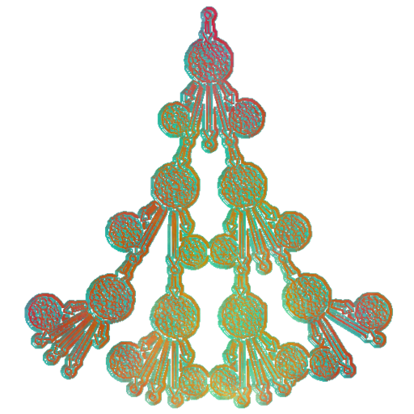

# `slingshot-microservice`: A Rust framework for standard microservice design



`slingshot-microservice` is a Rust package that provides a simple, opinionated
framework for building microservices.  The framework makes the following
assumptions about a microservice:

1. A microservice listens to incoming requests on its own dedicated and
   singular queue (RabbitMQ).
2. Incoming requests are in the form of a 64-bit unsigned integer (`u64`).
2. Microservices process requests via a `process` function, which takes one
   argument: the incoming request (`u64`).
3. The `process` function returns a set of IDs (also `u64`) that are the result
   of processing the incoming request.  Each of these IDs is also associated
   with a "case variable" that is used for routing the result to the
   appropriate outbound queues.
4. Rather than hard-coding the inbound and outbound queues, the
   microservice communicates with a self-contained configuration service shared
   across all microservices.
   i.  This service provides inbound queue name, as well as any outbound queues
       and their corresponding case variables.
   ii. It is also responsible for providing the RabbitMQ connection details
	   (host, port, username, password), and any bucket names if using S3 for
	   storage.

The `slingshot-microservice` framework handles setting up the RabbitMQ
connection, listening to the inbound queue and routing results based on case variables.

## Example Usage

```rust
use slingshot_microservice::Microservice;

fn process(request: u64) -> Vec<(u64, String)> {
    // Example processing logic: return the request ID and a case variable
    vec![(request, "case_a".to_string())]
}

fn main() {
    // Create a new microservice instance with the processing function
    let microservice = Microservice::new(
        "simple-microservice",
        "sys-map.example.com",
        process
    );

    // Start the microservice (this will block and listen for incoming requests)
    microservice.start();
}
```

## How it works:

The configuration service responds to requests of the form:
`https://{HOSTNAME}/{MICROSERVICE_NAME}`.  All configuration is done over HTTP
GET. The response contains a JSON object with two fields: an inbound queue name
and a mapping of case variables to outbound queue names. For example:

```json
{
    "in": "simple-microservice-inbound",
    "out": [
        {
            "case": "case_a",
            "queues": ["case_a_outbound_1", "case_a_outbound_2"]
        },
        {
            "case": "case_b",
            "queues": ["case_b_outbound"]
        }
    ]
}
```

The case variables can be any primitive type (e.g. string, integer, boolean).
E.g. a binary classification microservice might decide on which outbound queue
to send results to based on a case variable that is either `false` or `true`:

```json
{
    "in": "binary-classification-inbound",
    "out": [
        {
            "case": false,
            "queues": ["binary-classification-false-outbound"]
        },
        {
            "case": true,
            "queues": ["binary-classification-true-outbound"]
        }
    ]
}
```

The configuration service also provides the RabbitMQ connection details (host,
port, etc.):

When the microservice first starts up, it makes a request to the configuration
service to get the queue metadata.  Then it starts to listen to the inbound
queue.  Inbound requests are processed by the user-programmed `process`
function, which returns a set of tuples of the form `(result_id, case_variable)`.
The microservice then routes each `result_id` to the appropriate outbound
queue(s) based on the `case_variable`, using a process that looks like this:

Peudocode:
```
for each (result_id, case_variable) in process(request):
    for each outbound_queue in config.out[case_variable]:
        send result_id to outbound_queue
```
